# Preguntas de reflexion

*• Pregunta 1: ¿Por qué surgió la necesidad de DevOps en el desarrollo de software?*

<p>Surge debido a la necesidad de integración entre los equipos de desarrollo y producción. Debido a las constantes actualizaciones que presenta el software,dicha falta de integración ocasiona muchas dificultades</p>

*• Pregunta 2: Explica cómo la falta de comunicación y coordinación entre los equipos de
desarrollo y operaciones en el pasado ha llevado a la creación de DevOps.*

<p>La falta de unidad en los equipos de producción y desarrollo provocaban muchos inconvenientes, como el uso de diferentes versiones de una misma herramienta. </p>


*• Pregunta 3: Describe cómo el principio de mejora continua afecta tanto a los aspectos
técnicos como culturales de una organización.*

Desde el punto de vista técnico, el  análisis continuo de métricas de rendimiento y la utilización de flujos automatizados resultan en confiabilidad, adaptabilidad y eficiencia en los procesos de entrega de software.

Culturalmente, fomenta un entorno colaborativo, alentando la cultura de aprendizaje y eliminando los silos internos.


*• Pregunta 4: ¿Qué significa que DevOps no se trata solo de herramientas, individuos o
procesos?*

El texto menciona que DevOps es más que el uso de herramientas, individuos o procesos. En cambio, es un cambio de cultura, una mentalidad conjunta dentro del equipo, la cual elimine toda fricción entre sus partes.


*• Pregunta 5: Según el texto, ¿cómo contribuyen los equipos autónomos y multifuncionales a
una implementación exitosa de DevOps?*

Gracias a las diversas habilidades presentes dentro de un equipo se agilizará el flujo del trabajo y se reducirá la dependencia de equipos externos. 


# Documentación

## Configuración del entorno ##

Creación de los directorios correspondientes
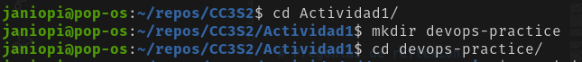

npm: Node package manager
(El flag -y omite las preguntas al momento de crear el proyecto)
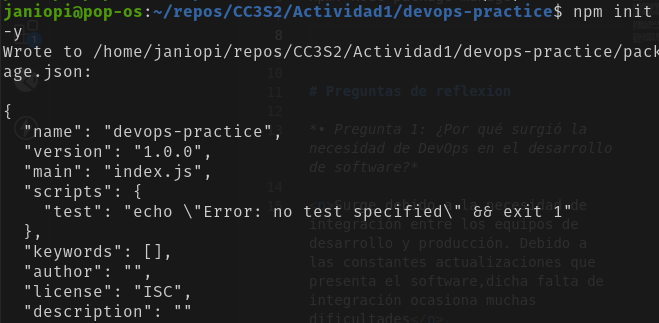

Instalación de express(framework backend) y jest(framework testeo)
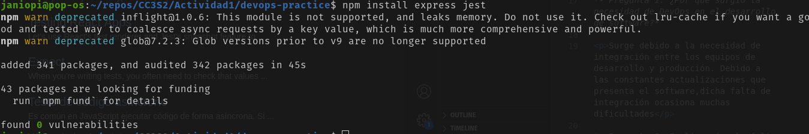

Estructura del proyecto
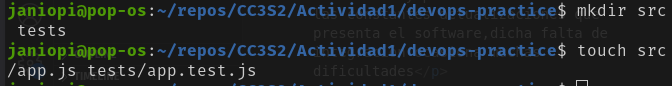

Implementación de la API REST
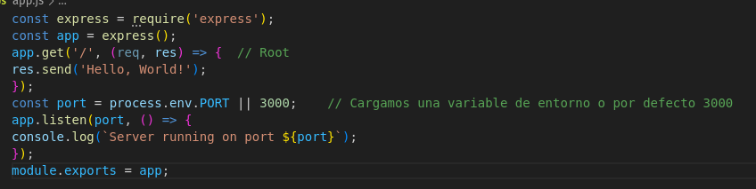

Implementación del test para 'GET /'
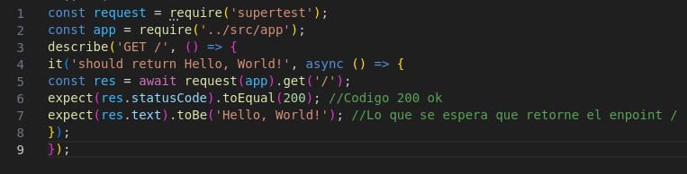


## Pipeline CI/CD ##
Configuración integración continua(CI) con GitHub actions

Automatización con GitHub Actions
```
name: CI/CD Pipeline
on:
push:
branches:
- main
pull_request:
branches:
- main
jobs:
build:
runs-on: ubuntu-latest
steps:
- name: Checkout code
uses: actions/checkout@v2
- name: Set up Node.js
uses: actions/setup-node@v2
with:
node-version: '14'
- name: Install dependencies
run: npm install
- name: Run tests
run: npm test
- name: Build Docker image
run: docker build -t devops-practice .
- name: Run Docker container
run: docker run -d -p 3000:3000 devops-practice


```


Configuración entrega continuda(CD) con Docker

Dockerfile
```
#Usa la imagen oficial de Node.js
FROM node:14
# Establece el directorio de trabajo en el contenedor
WORKDIR /app
# Copia los archivos package.json y package-lock.json
COPY package*.json ./
# Instala las dependencias
RUN npm install
# Copia el resto de los archivos de la aplicación
COPY . .
# Expone el puerto en el que la aplicación correrá
EXPOSE 3000
# Comando para iniciar la aplicación
CMD ["node", "src/app.js"]

```


Construyendo la docker image
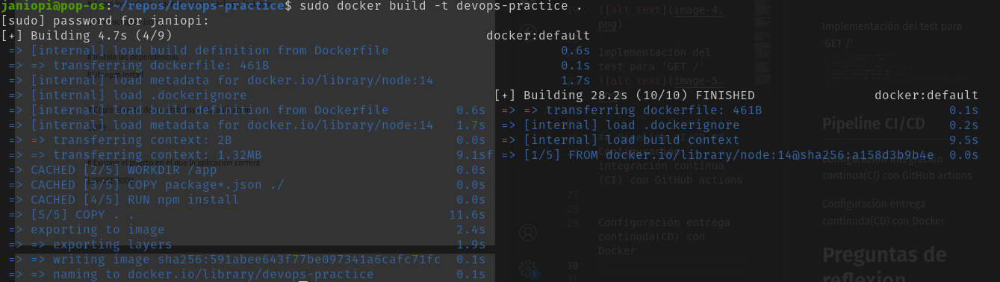

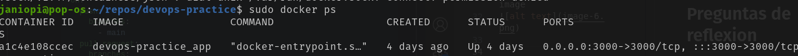

(En este caso el contenedor ya se estaba ejecutando)
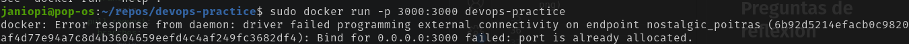

Funciona :D


En caso queramos detener la ejecucion del contenedor
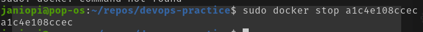

Docker-compose


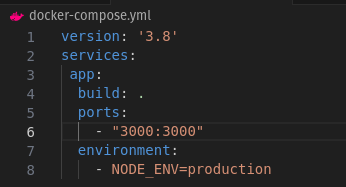


```
docker-compose up --build -d
```

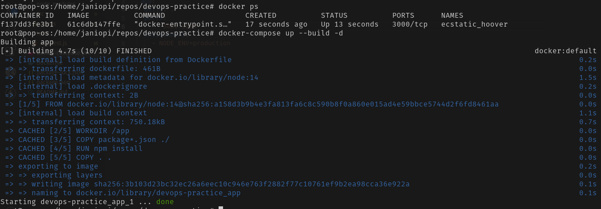


# Evaluación y comentarios
Esta actividad nos ha permitido ver de manera simplificada el proceso de automatización en el desarrollo mediante CI/CD

GitHub Actions (CI) : Gracias a la automatización, los cambios en el código se contruyen, prueban y despliegan de forma automática.


Docker (CD) : Nos permite crear "imagenes"  las cuales guardan nuestras configuraciones, con el objetivo de evitar errores de compatibilidad en otros equipos. Se pueden crear multiples instancias de dichas imagenes, conocidas como contenedores

Docker: Asegura que la aplicación se ejecute de manera consistente, sin importar el entorno en el que se despliegue. Esto elimina problemas comunes como las diferencias entre entornos de desarrollo, pruebas y producción, reduciendo así posibles fricciones entre los equipos de desarrollo (Dev) y operaciones (Ops).


